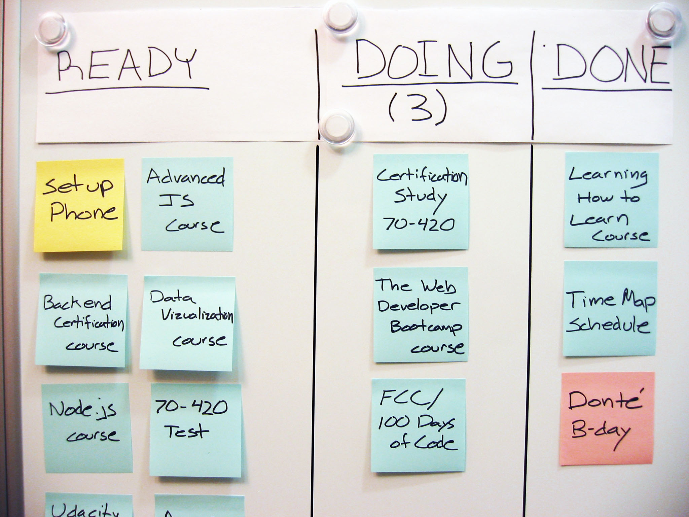
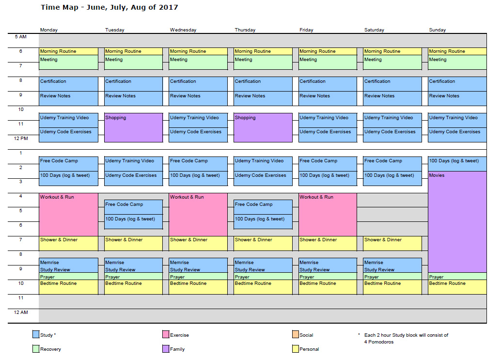

# James Priest

## 100 Days Of Code Log

**Commitment:** ***I will ~~code~~ learn for at least an hour a day for the next 100 days.***

This is part of Alexander Kallaway's [#100DaysOfCode](https://github.com/Kallaway/100-days-of-code "the official repo") challenge. More details about the challenge can be found here: [100daysofcode.com](http://100daysofcode.com/ "100daysofcode.com").

|  Start Date   | End Date     |
| ------------- | ------------ |
| June 12, 2017 | ------------ |

## Goals

- Code daily
- Expand portfolio
- Hone Git CLI skills
- Get established in the GitHub community
- Get through as many MOOCs, certifications, and bootcamp classes as possible

### Secondary goals

- Pass my Microsoft Programming in HTML5 with JavaScript & CSS3 Certification - [Exam 70-480](https://www.microsoft.com/en-us/learning/exam-70-480.aspx "Exam 70-480: Programming in HTML5 with JavaScript and CSS3")
- Knock out the following...
  - Complete [FCC Front End Development Certification](https://www.freecodecamp.com/james-priest "FCC Profile") program
  - Complete [Udemy The Web Developer Bootcamp](https://www.udemy.com/the-web-developer-bootcamp/ "The Web Developer Bootcamp by Colt Steele") certificate program
  - Complete [Udemy JavaScript: Understanding the Weird Parts](https://www.udemy.com/understand-javascript "JavaScript: Understanding the Weird Parts by Anthony Alicia") certificate program
- Considering...
  - Maybe [Udacity's Front-End Web Developer Nanodegree](https://www.udacity.com/course/front-end-web-developer-nanodegree--nd001?utm_medium=referral&utm_campaign=api) program
  - Maybe [Coding Dojo's Full Stack Developer Bootcamp](http://www.codingdojo.com/web-development-accelerators)

# Log

## JavaScript Array Methods

### Day 9: July 2, 2017 - Sunday

**Today's Project(s):**

- javascript-array-methods - Vanilla JavaScript project to show what each JS Array object method does
- FCC Code Challenges

**Progress:**

- Completed migration of javascript-array-methods v1.0.0 to GitHub
- Started jQuery selector section of FCC

**Link to work:**

- [JavaScript Array Methods](https://github.com/james-priest/javascript-array-methods "GitHub repo") on  GitHub - click image to see demo
- [My FCC Code Portfolio](https://www.freecodecamp.com/james-priest "james-priest's code portfolio on FreeCodeCamp")

**Thoughts:** Finally good to get the JavaScript Array Methods app up on GitHub. Next I need to modify it to use Bootstrap and Objects to hold data rather than arrays.

---

## Code & Dev activities

### Day 8: June 30, 2017 - Friday

**~~Today's~~ Last Week's Project(s):**

- FCC Code Challenges
- Received and accepted an invitation to join [**DWYL**](https://github.com/dwyl "Do What You Love") on GitHub
- Added projects and people to my [Stars](https://github.com/james-priest?tab=stars) & [Following](https://github.com/james-priest?tab=following) tabs on GitHub
- Signed up for [Netlify](http://netlify.com) - they host static sites through CLI deploy. npm install and deploy any repo
- Researched Back End learning path and decided on .NET Core since its going to be the high💲dollar💲 technology for 2018. Read the ASP.NET Core [prediction](https://stackify.com/net-core-csharp-next-programming-language/ "Why .NET Core and C# are the Next Big Thing") about how it will be the next big thing. I also know & love the MS development environment.
- Retooled my dev environments:
  - Updated Visual Studio 2017 to Enterprise and v15.2
  - Got my VS Code plugins in line
  - Installed [notepad2](https://xhmikosr.github.io/notepad2-mod/) (great notepad replacement)
- Evaluated many of the Code Playgrounds out there to solve for two needs:
  - having a place to test code as I go through tutorials
  - having a place to organize and  host samples of work
- Decided to set up a [GitHub repo](https://github.com/james-priest/code-exercises "code-exercises") to contain my source code instead. I'll still use JSBin for quick JS, ES6 and TypeScript tests.
- Created additional repos to migrate my test projects to:
  - [code-exercises](https://github.com/james-priest/code-exercises)
  - [javascript-array-methods](https://github.com/james-priest/javascript-array-methods)
  - [web-calculator](https://github.com/james-priest/web-calculator)
- Researched [Open Source Friday](https://opensourcefriday.com/), [FirstTimersOnly](http://www.firsttimersonly.com/) movement and [How to Contribute](https://opensource.guide/how-to-contribute/ "") in Open Source
- Got caught in a rabbit hole of learning regarding JavaScript concepts, HTML5 api features & Google Web articles. Covered the following:
  - [Functional Composition](https://medium.com/javascript-scene/master-the-javascript-interview-what-is-function-composition-20dfb109a1a0 "Master the JavaScript Interview: What is Functional Composition?")
  - [Closures](https://medium.com/javascript-scene/master-the-javascript-interview-what-is-a-closure-b2f0d2152b36 "Master the JavaScript Interview: What is a Closure?")
  - [Hoisting](https://dev.to/imwiss/understanding-hoisting-in-javascript "Understanding Hoisting in JavaScript")
  - [Service Workers](https://developers.google.com/web/fundamentals/getting-started/primers/service-workers "Service Workers: An Introduction") or Web Workers
  - [Promises](https://developers.google.com/web/fundamentals/getting-started/primers/promises)
  - App Cache, Local Storage, Sessions Storage, IndexedDB & Web SQL
  - [Chrome Dev Tools](https://developers.google.com/web/tools/chrome-devtools/)
  - Researched Google's [Material Design](https://material.io/guidelines/material-design/introduction.html "Introduction to Material Design")
  - Read through Google Codelabs - [Your First PWA](https://developers.google.com/web/fundamentals/getting-started/codelabs/your-first-pwapp/ "You First Progressive Web App") and [Your First Offline Web App](https://developers.google.com/web/fundamentals/getting-started/codelabs/offline/)
  - Read about [CSS Grid vs. Flexbox](https://tutorialzine.com/2017/03/css-grid-vs-flexbox "CSS Grid vs. Flexbox: A Practical Comparison")

**Progress:**

- Completed Responsive Design with Bootstrap section of FCC! 😃

**Link to work:**

- [My FCC Code Portfolio](https://www.freecodecamp.com/james-priest "james-priest's code portfolio on FreeCodeCamp")

**Thoughts:** All this research and learning was great and necessary but it ate up another week's worth of "code" time. I'm not worried about it though.  I've come to the conclusion that it all moves me towards the same ends.

I also don't trip on whether I'm doing a tutorial or coding something from scratch. It's all development time and one usually proceeds the other if I'm going to employ the most effective learning style.

The one challenge I need to get in check is following through to the end of one project, learning path, or class with a single mindedness of purpose before getting distracted or caught up in another. I feel I might be missing something if I don't investigate and dig deep into a concept I don't fully understand. This is the thinking that gets me spread out with 10 browser instances of 20 open tabs each and then scrambling to keep it all straight. [OneTab Chrome extension](https://www.one-tab.com/ "Reduces tab clutter and memory footprint by 95%") is **great** for this.

Bottom line is I'm making progress and learning how to organize and keep 10 plates spinning at any given time. The next soft skill to incorporate will be the concept of _balance_!

---

## Bootstrap Responsive Design

### Day 7: June 24, 2017 - Saturday

**Today's Project(s):**

- FCC Code Challenges

**Progress:**

- Started Responsive Design with Bootstrap section of FCC

**Link to work:**

- [My FCC Code Portfolio](https://www.freecodecamp.com/james-priest "james-priest's code portfolio on FreeCodeCamp")

**Thoughts:** It's easy for me to get distracted with any one of the six different projects I'm working on at the same time.  I need to limit my WIP in order to make consistent headway.

---

## Hoisting, Closures, and Module Patterns

### Day 6: June 22, 2017 - Thursday

**Today's Project(s):**

- FCC Code Challenges
- Learned about closures & module patterns in JavaScript

**Progress:**

- Finished the Gear Up for Success section of FCC (Joined FCC forum, Linked-In Alumni Network & Free Code Camp Group in Pasadena)

**Link to work:**

- [My FCC Code Portfolio](https://www.freecodecamp.com/james-priest "james-priest's code portfolio on FreeCodeCamp")
- [Understanding Hoisting in JavaScript](https://dev.to/imwiss/understanding-hoisting-in-javascript)
- [What is a Closure](https://developer.mozilla.org/en-US/docs/Web/JavaScript/Closures)
- [JavaScript Module System Showdown: CommonJS vs AMD vs ES2015](https://t.co/l3SLLnxvZf "JavaScript article on auth0.com")

**Thoughts:** I'm taking time to read about technologies, methodologies and language conventions. Right now it's a jumble of information but I know eventually it will all start to click and make sense.

---

## HTML & CSS in FreeCodeCamp

### Day 5: June 20, 2017 - Tuesday

**Today's Project(s):**

- FCC Code Challenges

**Progress:**

- Finished the HTML5 & CSS section

**Link to work:**

- [My FCC Code Portfolio](https://www.freecodecamp.com/james-priest "james-priest's code portfolio on FreeCodeCamp")

**Thoughts:** So I skipped 5 days of postings & tweets but still was productive in my studies. I spend 8-10 hours in front of the computer daily; sometimes its directly related to learning and code challenges but half the time it's about reading about a new technology or configuring my dev environment or fine-tuning a process. It's constant learning and applying that knowledge.

The key is to get and find efficiencies in your daily process and turn those into routine...

---

## HTML5 Exercises

### Day 4: June 15, 2017 - Thursday

**Today's Project(s):**

- FCC Code Challenges

**Progress:**

- Completed some form element exercises
- Completed css class & id selectors

**Link to work:**

- [My FCC Code Portfolio](https://www.freecodecamp.com/james-priest "james-priest's code portfolio on FreeCodeCamp")

**Thoughts:** Today was a little light on the workload. It's funny how I can spend ALL day on the computer do code-related activities without actually coding. :/ Go figure...

The important thing is that I did get something done and posted. I'm keeping it pushin...

---

## My Personal Kanban

### Day 3: June 14, 2017 - Wednesday

**Today's Project(s):**

- Kanban board
- FCC Code Challenges

**Progress:**

- Got going on my Kanban board

**Link to work:**

- [My FCC Code Portfolio](https://www.freecodecamp.com/james-priest "james-priest's code portfolio on FreeCodeCamp")

**Thoughts:** This took a little while to get started on.  I'm reading Personal Kanban by Jim Benson. Here's a link to the companion site: [Personal Kanban](http://www.personalkanban.com/pk/ "Short Overview and YouTube video of Personal Kanban").

---

## My Time Map

### Day 2: June 13, 2017 - Tuesday

**Today's Project(s):**

- Time Map - My Daily Code Schedule
- FCC Code Challenges

**Progress:**

- Wrapped up Time Map

**Link to work:**

- [My FCC Code Portfolio](https://www.freecodecamp.com/james-priest "james-priest's code portfolio on FreeCodeCamp")

**Thoughts:** Today's work was more organizational and productivity-based in nature but necessary nonetheless. It took me a while to come up with an aggressive but reasonable schedule.

My goal is to do 4 Pomodoros for each two-hour Study block (in blue).

---

## The Web Developer Bootcamp

### Day 1: June 12, 2017 - Monday

**Today's Project(s):**

- FCC Code Challenges
- Udemy's [The Web Developer Bootcamp](https://www.udemy.com/the-web-developer-bootcamp/ "Web Developer Bootcamp Udemy Course by Colt Steele") course

**Progress:**

- More CSS on FCC
- set font styles

**Link to work:**

- [My FCC Code Portfolio](https://www.freecodecamp.com/james-priest "james-priest's code portfolio on FreeCodeCamp")

**Thoughts:** Signed up for Colt Steele's [The Web Developer Bootcamp](https://www.udemy.com/the-web-developer-bootcamp/ "Web Developer Bootcamp Udemy Course by Colt Steele") course at Udemy today. I'm looking forward to using the bootcamp along side FCC as part of my dev program. Apparently folks are doing this with [good results](https://forum.freecodecamp.com/t/the-web-developer-bootcamp-udemy-review/61595/8 "Review of Web Developer Bootcamp").

It'll go something like this:

1. Watch video
1. Code the exercises myself
1. Do FCC Code Challenges
1. Update my [100 days of Code log](https://github.com/james-priest/100-days-of-code-log "this log") and [tweet](https://twitter.com/james_priest1 "James Priest on Twitter") my results

---

## Learning How to Learn in 4 weeks

### Day (0): June 11, 2017 - Sunday

**Today's Project(s):**

- FCC Code Challenges
- Learning How to Learn MOOC

**Progress:**

- More CSS
- set font styles

**Link to work:**

- [My FCC Code Portfolio](https://www.freecodecamp.com/james-priest "james-priest's code portfolio on FreeCodeCamp")

**Thoughts:** Finished Coursera's [Learning How to Learn](https://www.coursera.org/learn/learning-how-to-learn "Coursera: Learning How to Learn") and passed with 100% on my final exam!

---

## Learning How to Learn on Coursera

### Day (-1): June 10, 2017 - Saturday

**Today's Project(s):**

- FCC Code Challenges
- Learning How to Learn MOOC

**Progress:**

- Worked on CSS
- Imported Google font
- set font styles

**Link to work:**

- [My FCC Code Portfolio](https://www.freecodecamp.com/james-priest "james-priest's code portfolio on FreeCodeCamp")

**Thoughts:** I'm wrapping up a great MOOC from Coursera called [Learning How to Learn](https://www.coursera.org/learn/learning-how-to-learn "Coursera: Learning How to Learn") This in the top ten of all-time most popular MOOCs. I can't recommend it enough for getting prep'd to do FCC or any other intensive development program, bootcamp or online course.

---

## GitHub, Twitter & Free Code Camp

### Day (-2): June 9, 2017 - Friday

**Today's Project(s):**

- GitHub profile
- Twitter account
- FCC Profile

**Progress:**  Prep work...Today was time spent on setup. This includes:

- Setup
  - Forked the Official [100-days-of-code GitHub Repo](https://github.com/Kallaway/100-days-of-code "Official #100DaysOfCode GitHub Repo")
  - Updated [my GitHub profile](https://github.com/james-priest "James Priest on GitHub") (@james-priest)
  - Got [my Twitter account](https://twitter.com/james_priest1 "James Priest on Twitter") going (@james_priest1)
- Tweet'd my commitment to the 100-days-of-code challenge

**Link to work:**

- My GitHub [100-days-of-code-log](https://github.com/james-priest/100-days-of-code-log "this repo")

**Thoughts:** Glad to be starting this.

<!--
## Day #: June 1, 2017 - Thursday

**Today's Project(s):**

**Progress:**

-

**Link to work:**

- [My FCC Code Portfolio](https://www.freecodecamp.com/james-priest "james-priest's code portfolio on FreeCodeCamp")

**Thoughts:**

---

1. [Find the Longest Word in a String](https://www.freecodecamp.com/challenges/find-the-longest-word-in-a-string)
2. [Title Case a Sentence](https://www.freecodecamp.com/challenges/title-case-a-sentence)-->
