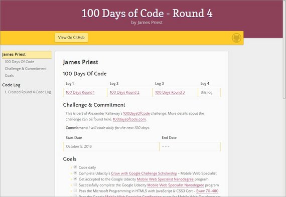

<!-- markdownlint-disable MD022 MD032 -->
# James Priest

## 100 Days Of Code

| Log 1 | Log 2 | Log 3 | Log 4 |
| --- | --- | --- |
| [100 Days Round 1](https://james-priest.github.io/100-days-of-code-log/) | [100 Days Round 2](https://james-priest.github.io/100-days-of-code-log-r2/) | [100 Days Round 3](https://james-priest.github.io/100-days-of-code-log-r3/) | this log |

## Challenge & Commitment
This is part of Alexander Kallaway's [100DaysOfCode](https://github.com/Kallaway/100-days-of-code "the official repo") challenge. More details about the challenge can be found here: [100daysofcode.com](http://100daysofcode.com/ "100daysofcode.com").

**Commitment:** *I will code daily for the next 100 days.*

|  Start Date   | End Date     |
| ------------- | ------------ |
| October 5, 2018   | - - - |

## Goals

- [x] Code daily
- [x] Complete Udacity's [Grow with Google Challenge Scholarship](https://www.udacity.com/grow-with-google) - Mobile Web Specialist
- [x] Get accepted to the Google Udacity [Mobile Web Specialist Nanodegree](https://www.udacity.com/course/mobile-web-specialist-nanodegree--nd024) program
- [ ] Successfully complete the Google Udacity [Mobile Web Specialist Nanodegree](https://www.udacity.com/course/mobile-web-specialist-nanodegree--nd024) program
- [ ] Pass the Microsoft Programming in HTML5 with JavaScript & CSS3 Cert - [Exam 70-480](https://www.microsoft.com/en-us/learning/exam-70-480.aspx "Exam 70-480: Programming in HTML5 with JavaScript and CSS3")
- [ ] Pass the Google [Mobile Web Specialist Certification](https://developers.google.com/training/certification/mobile-web-specialist/) exam for Mobile Web Development

# Code Log
<!--

## 1.
### Day 1: January,10 2018 - Saturday

**Project:** Mobile Web trackS

**Progress:**

**Thoughts:**

**Link to Work:**
---

## 1. Create New Codelog
### Day 1: May 9, 2018 - Wednesday

**Project:** Google Udacity Nanodegree (Mobile Web Specialist)

**Progress:** Completed *Lesson 5: Optimizations* from the Udacity course: [Responsive Web Design Fundamentals](https://www.udacity.com/course/responsive-web-design-fundamentals--ud893).

This lesson dealt with how to adapt:

- Responsive tables for mobile (hidden columns, contained scrolling, block elements)
- Font sizing across different viewports
- Images resolution based on device pixel density
- Minor breakpoints

Read more: [Notes - Responsive Web Design Lesson 5: Optimizations](https://james-priest.github.io/udacity-nanodegree-mws/course-notes/responsive-web-design-fundamentals.html#lesson-5-optimizations)

**Links:**
- My Course Notes - [Responsive Web Design Fundamentals](https://james-priest.github.io/udacity-nanodegree-mws/course-notes/responsive-web-design-fundamentals.html)
- Udacity's [Responsive Web Design Fundamentals by Google](https://www.udacity.com/course/responsive-web-design-fundamentals--ud893) (free 2 week course)

---

-->
---

## 4. Restaurant App - Stage 3 Offline Favorites
### Day 4: October 9, 2018 - Tuesday

**Project:** Google Udacity Nanodegree (Mobile Web Specialist)

**Progress:** Continued the *Restaurant Reviews App - Stage 3* project.

I completed the last piece of functionality for this app which is the ability to mark a restaurant as a favorite while the app is offline.

I added the following:

- Set click handlers for the favorite buttons
- Created a function to use Fetch API when updating the online DB
- Added error handling which updates the data locally
- Created code to save all requests when offline and then send to server when connected once again.

See the code notes here: [Restaurant Review App - Stage 3: Section 12 Offline Favorites](https://james-priest.github.io/mws-restaurant-stage-1/stage3.html#12-offline-favorites).

**Links:**
- My Project Notes - [Restaurant Review App - Stage 3](https://james-priest.github.io/mws-restaurant-stage-1/stage3.html)
- GitHub Repo - [MWS Restaurant Stage 1](https://github.com/james-priest/mws-restaurant-stage-1) - Client App
- GitHub Repo - [MWS Restaurant Stage 2](https://github.com/james-priest/mws-restaurant-stage-2) - Server App
- GitHub Repo - [MWS Restaurant Stage 3](https://github.com/james-priest/mws-restaurant-stage-3) - Server App with additional Endpoints
- Udacity’s [Mobile Web Specialist Nanodegree Program](https://www.udacity.com/course/mobile-web-specialist-nanodegree--nd024) by Google (6 month course)

---

## 3. Restaurant App - Stage 3 Kill Page Refresh
### Day 3: October 7, 2018 - Sunday

**Project:** Google Udacity Nanodegree (Mobile Web Specialist)

**Progress:** Continued the *Restaurant Reviews App - Stage 3* project.

There were two places in my app where I was lazily reloading the page in order to redraw the data on the page.

This was clunky and didn't make sense to do since I was using Ajax everywhere else to eliminate round-trips to the server.

See the code notes here: [Restaurant Review App - Stage 3: Section 11 Kill Page Refresh](https://james-priest.github.io/mws-restaurant-stage-1/stage3.html#11-kill-page-refresh).

**Links:**
- My Project Notes - [Restaurant Review App - Stage 3](https://james-priest.github.io/mws-restaurant-stage-1/stage3.html)
- GitHub Repo - [MWS Restaurant Stage 1](https://github.com/james-priest/mws-restaurant-stage-1) - Client App
- GitHub Repo - [MWS Restaurant Stage 2](https://github.com/james-priest/mws-restaurant-stage-2) - Server App
- GitHub Repo - [MWS Restaurant Stage 3](https://github.com/james-priest/mws-restaurant-stage-3) - Server App with additional Endpoints
- Udacity’s [Mobile Web Specialist Nanodegree Program](https://www.udacity.com/course/mobile-web-specialist-nanodegree--nd024) by Google (6 month course)

---

## 2. Restaurant App - Stage 3 Post Offline Data
### Day 2: October 6, 2018 - Saturday

**Project:** Google Udacity Nanodegree (Mobile Web Specialist)

**Progress:** Continued the *Restaurant Reviews App - Stage 3* project.

In this part of my project I finished the offline data processing queue. This is responsible for sending offline review data to the server once connectivity is re-established.

The code does the following:
1. On page load it gets the all offline requests as an IDB cursor
2. It opens the first request and attempts to POST it with fetch
3. If we are offline then it skips to the next and tries again
4. Once we do successfully POST we get the resulting record back
5. We then delete the offline request from the offline store
6. We add the new review record and delete the old record from reviews store
7. The add & delete is done in the same transaction so if it fails it rolls back

See the code notes here: [Restaurant Review App - Stage 3: Section 10 Post Offline Data](https://james-priest.github.io/mws-restaurant-stage-1/stage3.html#10-post-offline-data).

**Links:**
- My Project Notes - [Restaurant Review App - Stage 3](https://james-priest.github.io/mws-restaurant-stage-1/stage3.html)
- GitHub Repo - [MWS Restaurant Stage 1](https://github.com/james-priest/mws-restaurant-stage-1) - Client App
- GitHub Repo - [MWS Restaurant Stage 2](https://github.com/james-priest/mws-restaurant-stage-2) - Server App
- GitHub Repo - [MWS Restaurant Stage 3](https://github.com/james-priest/mws-restaurant-stage-3) - Server App with additional Endpoints
- Udacity’s [Mobile Web Specialist Nanodegree Program](https://www.udacity.com/course/mobile-web-specialist-nanodegree--nd024) by Google (6 month course)

---

## 1. Created Round 4 Code Log
### Day 1: October 5, 2018 - Friday

**Project:** Google Udacity Nanodegree (Mobile Web Specialist)

**Progress:** Created a new GitHub repo for my Round 4 code log.

This now uses a dusky rose theme and has an updated nav which I've migrated over to my previous two logs.

I'm still finishing up my Udacity Mobile Web Specialist Nanodegree...

Hopefully will be done in another week...

**Links:** My GitHub repo [https://github.com/james-priest/100-days-of-code-log-r4](https://github.com/james-priest/100-days-of-code-log-r4)